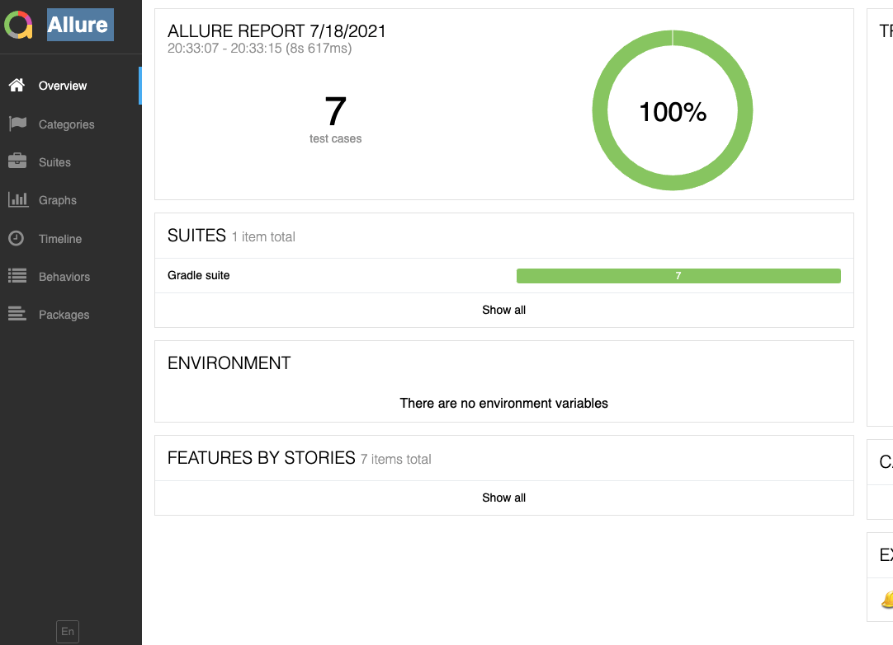
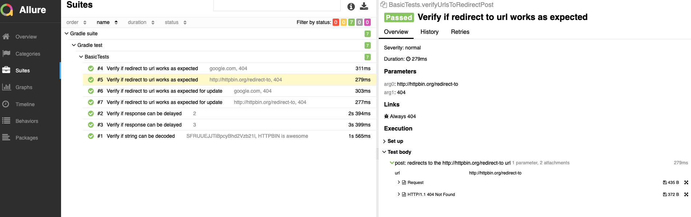

# Description
Basic api tests (CRUD) for the service http://httpbin.org/

# Used tools
- Java 8+
- Gradle 
- TestNG
- Rest-assured
- Allure

# Execution
* locally via IDE
* using Gradle
```
gradle test
```

# How to generate report
Get test report after test execution
will be located here jsonplaceholder-tests/api-tests/build/reports/allure-report

```
 gradle allureReport 
```
 or 
 ```
 allure serve allure-results
```
 or 
 ```
 gradle test allureReport
```

# Troubleshooting
- clean gradle daemon
```
gradle --stop
```
- invalidate cache and restart
- try 
```
gradle build
```

#Reports
 
 
 .
 
 An example of the report can be found here 
 api-tests/src/test/resources/allure-rep.html

#TODO
- increase test coverage: add negative scenarios, more data in dataprovider
- create bash file to start docker
- add BDD
- add models

